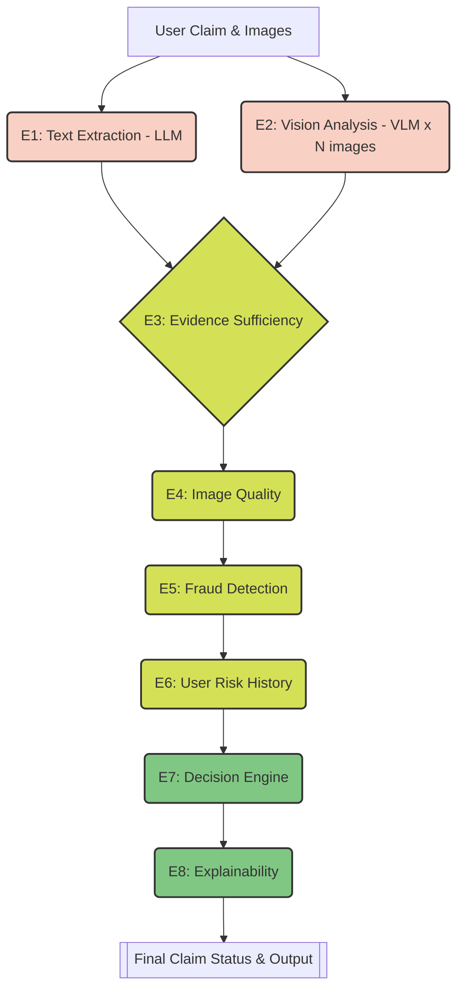

# Multi-Modal Evidence Review Pipeline

## Overview
An automated AI pipeline for insurance and customer support teams. It uses Vision-Language Models (VLMs), object detection (YOLOv8), and deterministic rule engines to verify damage claims for cars, laptops, and packages while automatically flagging fraudulent or mismatched images.

## Architecture



- **8 Deterministic Engines**: Claim extraction, Vision analysis, Evidence checking, Quality assessment, Fraud detection, Risk evaluation, Decision making, Explanation
- **4 LLM Providers**: Gemini 2.5 Flash → Groq (Llama 4 Scout) → OpenRouter → NVIDIA (Llama 4 Maverick) with automatic fallback
- **Per-key Rate Limiting**: Sliding-window RPM/RPD tracking with proactive key rotation
- **Multi-Model Comparison**: Independent runs per provider with majority-vote consensus

## Setup
```bash
pip install -r requirements.txt
# Add API keys to .env file
```

## .env Configuration
```
GEMINI_API_KEYS=key1,key2,key3
GROQ_API_KEY=your_key
OPENROUTER_API_KEY=your_key
NVIDIA_API_KEY=your_key
```

## Usage
```bash
cd code
python main.py                          # Standard run (auto fallback)
python main.py --mode sample            # Run on sample claims
python main.py --provider nvidia        # Use specific provider
python main.py --retry-failed           # Re-process only failed claims
python compare_models.py --report-only  # Cross-model comparison
```

## Pipeline Flow
1. Load claims from CSV + user history + evidence requirements
2. For each claim:
   - **E1 Claim Engine**: Extract claimed part/issue from conversation text (1 LLM call)
   - **E2 Vision Engine**: Analyze each image independently (N VLM calls)
   - **E3 Evidence Engine**: Check if evidence meets requirements (deterministic)
   - **E4 Quality Engine**: Assess image quality — blur, watermarks (deterministic)
   - **E5 Fraud Engine**: 8 fraud signal checks — wrong object, injection, manipulation (deterministic)
   - **E6 Risk Engine**: User history risk propagation (deterministic)
   - **E7 Decision Engine**: Final status determination (deterministic)
   - **E8 Explain Engine**: Consistency polish (deterministic)
3. Write output CSV with 14 columns

## Key Design Decisions
- **Two-call design**: Each image analyzed independently (prevents cross-contamination)
- **File-based caching**: SHA-256 keyed JSON cache, re-runs skip processed claims
- **Enum enforcement**: All output fields validated against allowed values
- **Graceful degradation**: API failures → "unknown" fallback, never crashes
