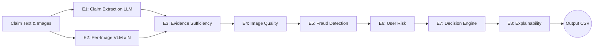

# Multi-Modal Evidence Review — Code

Production-grade multimodal damage claim verification platform for cars, laptops, and packages.

## Architecture

**10-Engine Pipeline with 2-Call LLM Design:**



- **Call 1** (text-only): Extracts claimed damage from conversation transcript
- **Call 2** (per-image): VLM analyzes each image independently
- **Engines 3-8**: Deterministic cross-referencing and decision-making

## Setup

### Prerequisites
- Python 3.11+
- Gemini API key (or Groq, OpenRouter, NVIDIA)

### Install

```bash
cd code
pip install -r requirements.txt
```

### Environment

```bash
# Set your Gemini API key
export GEMINI_API_KEY="your-key-here"
# Windows PowerShell:
$env:GEMINI_API_KEY="your-key-here"
```

## Run

### Process Test Claims
```bash
python main.py
```

### Process Sample Claims
```bash
python main.py --mode sample
```

### Force Fresh Evaluation (Skip Cache)
```bash
python evaluation/main.py --fresh
```

## Key Design Decisions

1. **2-Call Design** (not single mega-prompt):
   - Independent per-image analysis prevents cross-contamination
   - Enables vehicle identity cross-checking across images
   - Enables per-image quality assessment and best-image selection
   - Text instructions in one image don't influence other image analysis

2. **object_part = VISIBLE part** (not claimed part):
   - If user claims "hood scratch" but image shows "front_bumper broken_part" → `object_part=front_bumper`

3. **Deterministic engines after LLM calls**:
   - Evidence sufficiency, fraud detection, user risk → all rule-based
   - Reduces hallucination, increases reproducibility

4. **User history flags ALWAYS propagate**:
   - Even on `supported` claims, risk flags are added
   - History never overrides visual evidence

5. **Anti-hallucination**:
   - Temperature=0, structured JSON output
   - Explicit instructions to ignore text in images
   - Pydantic validation normalizes all outputs to allowed enums

## File Structure

```
code/
├── main.py                    # Orchestrator
├── config.py                  # All constants & enums
├── models.py                  # Pydantic data models
├── data_loader.py             # CSV/image I/O
├── requirements.txt           # Dependencies
├── README.md                  # This file
├── engines/
│   ├── claim_engine.py        # E1: Claim extraction
│   ├── vision_engine.py       # E2: Per-image VLM
│   ├── evidence_engine.py     # E3: Evidence sufficiency
│   ├── quality_engine.py      # E4: Image quality
│   ├── fraud_engine.py        # E5: Fraud detection
│   ├── risk_engine.py         # E6: User risk
│   ├── decision_engine.py     # E7: Decision aggregation
│   └── explain_engine.py      # E8: Explainability
├── llm/
│   ├── gemini_client.py       # Gemini API client
│   ├── prompts.py             # All prompt templates
│   └── cache.py               # Response caching
└── evaluation/
    ├── main.py                # Evaluation pipeline
    ├── metrics.py             # Scoring functions
    └── evaluation_report.md   # Generated report
```
