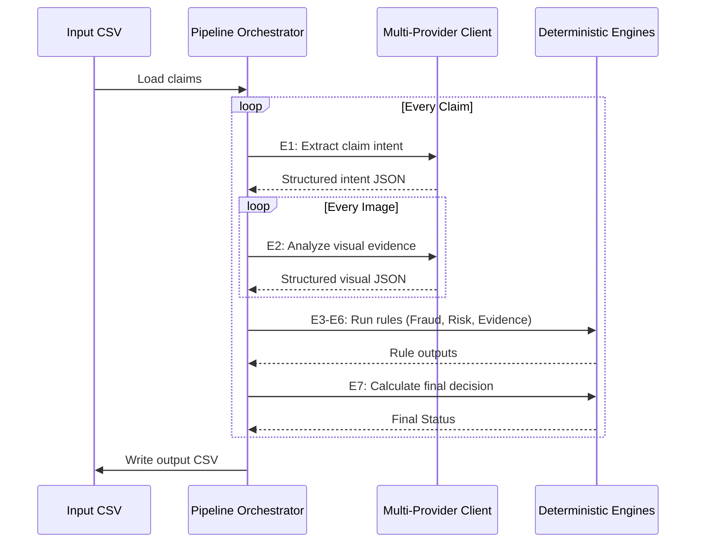

# Multi-Modal Evidence Review Architecture

This document describes the conceptual architecture of the 10-engine pipeline.

## System Components

1. **Claim Engine (E1)**: Extracts structured data (`claimed_object_part`, `claimed_issue_type`) from free-text user conversations. Protects against prompt injection attempts from fraudulent users.
2. **Vision Engine (E2)**: Evaluates each image individually. It is explicitly separated from E1 so it doesn't get biased by the user's claims. Detects objects, specific parts, issues, and severity.
3. **Evidence Engine (E3)**: Deterministically evaluates if the images meet the minimum required evidence standard defined in `evidence_requirements.csv` for the claimed damage.
4. **Quality Engine (E4)**: Evaluates lighting, blur, and cropping. Rejects unusable images.
5. **Fraud Engine (E5)**: Multi-factor fraud check scoring system. Detects:
   - Wrong objects/parts
   - Claim mismatches
   - Suspicious text instructions
   - Stock watermarks
   - Vehicle identity inconsistencies (multiple cars in one claim)
6. **Risk Engine (E6)**: Consumes user historical data to provide prior probability risk adjustments.
7. **Decision Engine (E7)**: Synthesizes the outputs of E1-E6 to output a final `claim_status` (`supported`, `contradicted`, `not_enough_information`).
8. **Explain Engine (E8)**: Generates a short, image-grounded justification for the user/auditor.
9. **Calibration Engine**: Provides severity mapping rules to align subjective damage (e.g., "small dent") into standard buckets (`low`, `medium`, `high`).
10. **LLM Orchestration Layer**: The `MultiProviderClient` dynamically routes requests between Gemini, Groq, OpenRouter, and NVIDIA. It handles rate limits (429), timeouts, and parsing errors transparently.

## Pipeline Lifecycle

